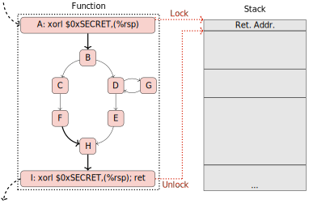

GTIRB Stack Stamp
=================

> **WIP**: this tutorial is a **Work in Progress**

TLDR; It is very easy to write binary transforms in GTIRB, see
[gtirb-stack-stamp](https://github.com/grammatech/gtirb-stack-stamp).

This tutorial demonstrates the development of a binary hardening
transform built on GTIRB.  We implement *stack stamping* (a simple
<abbr title="Return Oriented Programming">ROP</abbr> defense) as a
GTIRB-to-GTIRB transformation.  We leverage the
[ddisasm](https://github.com/grammatech/ddisasm) front-end to
disassemble binaries to GTIRB and the
[gtirb-pprinter](https://github.com/grammatech/gtirb-pprinter)
back-end to produce a new hardened executable from the stack stamped
GTIRB.  In practice the stack-stamp transform could be chained with
other GTIRB binary analysis or transformation passes.  Implementations
of the stack stamping transform are given in all three GTIRB API
languages;
Python [API](https://grammatech.github.io/gtirb/python/index.html)/[stack_stamp.py](https://github.com/GrammaTech/gtirb-stack-stamp/blob/master/gtirb_stack_stamp/stack_stamp.py),
C++ [API](https://grammatech.github.io/gtirb/cpp/index.html)/[gtirb_stack_stamp.hpp](https://github.com/GrammaTech/gtirb-stack-stamp/blob/master/include/gtirb_stack_stamp.hpp), and
Common Lisp [API](https://grammatech.github.io/gtirb/cl/index.html)/[gtirb-stack-stamp.lisp](https://github.com/GrammaTech/gtirb-stack-stamp/blob/master/gtirb-stack-stamp.lisp).

This document walks through the whole process of writing and applying
the *stack stamping* binary ROP protection in following steps:

- A. [Install Dependencies](#a-install-all-required-libraries-and-utilities)
- B. [Lift a binary to GTIRB](#b-lift-a-binary-to-gtirb)
- C.a [Implement your own stack-stamp transform](#ca-implement-your-own-stack-stamp-transform)
- C.b [Just run our stack-stamp transform](#cb-just-run-our-stack-stamp-transform)
- D. [Serialize GTIRB to a new executable and test](#d-serialize-gtirb-to-a-new-executable-and-test)
- E. [Visualize the difference using the gtirb-ghidra-plugin](#e-visualize-the-difference-using-gtirb-ghidra-plugin)
- F. Let us know what you think.  You can open an issue against
  [github.com/grammatech/gtirb](https://github.com/grammatech/gtirb)
  or email us at `gtirb@grammatech.com`.


## A. Install all required libraries and utilities

The following should be sufficient to install the required GTIRB
libraries and utilities (for complete installation instructions see
[GTIRB#Install](https://github.com/grammatech/gtirb#installing)).

1. Install the required binaries.

   - Windows:
     > NOTE: Windows users are warned that (1) you can't assemble and
     > link your rewritten ELF file on Windows unless you have the
     > required Linux build tool installed (2) the Common Lisp APIs
     > are not tested on Windows -- although they might work.
     1. Download `ddisasm-artifacts.zip`, `gtirb-artifacts.zip`, and
        `gtirb-pprinter-artifacts.zip` from
        [https://grammatech.github.io/gtirb/pkgs/windows-release](https://grammatech.github.io/gtirb/pkgs/windows-release);
     2. Extract each ZIP file to a suitable location.
     3. Add the /bin directory from each extracted ZIP file to your `PATH` environment variable.
        (Alternatively, provide the full path when you invoke the extracted executables.)
     4. If it is not already present on your system, install
        [Protobuf](https://developers.google.com/protocol-buffers/)
        version 3.0.0 or higher.
     5. If you plan to work in C++, you will also need
        [Boost](https://www.boost.org/), version 1.67.0 or higher.

   - Ubuntu16: install the binaries from the GTIRB xenial repository as follows.
     ```shell
     sudo apt-get install software-properties-common
     sudo add-apt-repository ppa:maarten-fonville/protobuf
     sudo add-apt-repository ppa:mhier/libboost-latest
     echo "deb https://grammatech.github.io/gtirb/pkgs/xenial ./" | sudo tee -a /etc/apt/sources.list.d/gtirb.list
     sudo apt-get update
     sudo apt-get install --allow-unauthenticated libgtirb-dev gtirb-pprinter ddisasm
     ```

   - Ubuntu18: install the binaries from the GTIRB bionic repository as follows.
     ```shell
     sudo apt-get install software-properties-common
     sudo add-apt-repository ppa:mhier/libboost-latest
     echo "deb [trusted=yes] https://grammatech.github.io/gtirb/pkgs/bionic ./" | sudo tee -a /etc/apt/sources.list.d/gtirb.list
     sudo apt-get update
     sudo apt-get install libgtirb-dev gtirb-pprinter ddisasm
     ```

   - Arch Linux: install pre-built `pacman` packages from
     [https://grammatech.github.io/gtirb/pkgs/arch](https://grammatech.github.io/gtirb/pkgs/arch)
     or install using the popular [aur helper](https://wiki.archlinux.org/index.php/AUR_helpers)
     [yay](https://github.com/Jguer/yay),
     ```shell
     yay -Sy gtirb-git gtirb-pprinter-git ddisasm-git
     ```

2. Make sure the required GTIRB components are available to your
   development environment.  This will depend on the language you want
   to work in:

   - C++: when you compile your transform, do all of the following.
     - Specify that the GTIRB `lib/` is a library directory.
     - Specify that the GTIRB `include/` is an include directory.
     - Link against the `gtirb` and `proto` libraries
       (Windows: `gtirb.lib`, `proto.lib`; Linux: `gtirb.so`, `proto.so`).

   - Python (note: must be Python 3):
     ```shell
     pip3 install gtirb gtirb-functions gtirb-capstone
     ```

   - Common Lisp:
     1. Clone the latest versions of these repositories into your
        `~/quicklisp/local-projects` directory (the versions in quicklisp
        don't yet have some important bugfixes)
        ```shell
        cd ~/quicklisp/local-projects
        git clone https://github.com/brown/protobuf
        git clone --branch quicklisp https://github.com/grammatech/gtirb
        git clone https://github.com/grammatech/gtirb-capstone
        git clone https://github.com/grammatech/gtirb-functions
        ```

     2. Install with quicklisp.
        ```lisp
        (ql:quickload '(:gtirb :gtirb-functions :gtirb-capstone))
        ```

## B. Lift a binary to GTIRB

GrammaTech's open-source GTIRB tooling supports disassembly of ELF
binaries only.

The example used in this tutorial is a Linux `ls` binary.  If you
prefer, you can work with a different ELF binary: just amend the
command lines as necessary to accommodate any file name differences.

If you are on a Linux system, you can analyze your system `ls`. For
Windows users, we have provided additional instructions for obtaining
a Linux `ls` binary.

Ubuntu 16, Ubuntu18, Arch Linux:

  1. Change to a suitable working directory.

  2. Run the datalog disassembler to analyze the binary and produce a
     GTIRB representation.

     ```shell
     ddisasm $(which ls) --ir ls.gtirb
     ```


Windows:

  1. Do you have easy access to a Linux `ls` binary? (For example, can
     you copy one from another local system?)

     - YES: Copy the binary to a suitable working directory and go to step 4.

     - NO: Go on to step 2.

  2. Download a Linux coreutils package from
     http://launchpadlibrarian.net/340091849/coreutils_8.26-3ubuntu4_amd64.deb
     (or another location if you prefer).

  3. Use a tool such as [7-Zip](https://www.7-zip.org/) to extract
     `/bin/ls` from the package, then copy it to a suitable working
     directory.

     (If your tool does not support selective extraction, unpack the
     entire package to a temporary location, then copy `/bin/ls` to
     your working directory.)

  4. Change to your working directory.


If you are not able to successfully analyze your chosen binary, please
[open an issue](https://github.com/GrammaTech/ddisasm/issues/new) to
let us know.


## C.a Implement your own stack-stamp transform

Stack stamping is a technique to help mitigate ROP style attacks.
This is done by 'stamping' (`xor`ing with a random number) the return
address on the stack at the beginning of every function, thus
encrypting it.  At the end of the function, before the return address
is popped off the stack and used, it is decrypted by `xor`ing it again
with the same random number.  This can be a very efficient protection.
Because it only requires an `xor` instruction this implementation
requires no registers, and while flags are affected, they are only
affected at function entry/exits where they do not need to be
preserved.  The effect of encrypting and decrypting the return address
on the stack like this is that ROP payloads become much more difficult
to write.  The attacker would have to know the random `xor` number for
every return to encrypt the return addresses in the payload.  These
numbers could easily be regenerated for every instance of a deployed
binary making generic payloads impossible.



Regardless of the implementation language the mechanics of this
transform will be the same -- we'll write a GTIRB-to-GTIRB rewriting
pass (the design of GTIRB is similar to LLVM in that it leverages
stand-alone passes for analysis or transformation).

```
  For each function f that has a single entry and single return.
     Build a random key k_f for f.
     On entry to f, encrypt the return address using k_f.
     On exit from f, decrypt the return address using k_f.
```


1. Implement the transform, using the [GTIRB
   manual](https://grammatech.github.io/gtirb/) as a reference.

   If you're developing in Python or Common Lisp you can work directly in
   a <abbr title="Read Eval Print Loop">REPL</abbr>, or use it to
   prototype a stand-alone implementation.

   - For all languages, start by importing the `gtirb` API and then
   loading your `ls.gtirb` file. For Common Lisp and Python, you will
   also need to import the `gtirb-functions` and `gtirb-capstone`
   APIs.

      - Python
        ```python
        from gtirb import *
        import gtirb_functions
        import gtirb_capstone
        ir = IR.load_protobuf("ls.gtirb")
        ```

      - C++
        ```c++
        #include <gtirb.hpp>
        gtirb::Context Ctx;
        std::ifstream File("ls.gtirb");
        gtirb::IR* Ir = *gtirb::IR::load(Ctx, File);
        ```

      - Common Lisp
        ```lisp
        (mapcar #'use-package '(:gtirb :gtirb-capstone :gtirb-functions))
        (defparameter *ir* (read-gtirb "ls.gtirb"))
        ```

   - The mechanism for identifying functions and their entry points
     depends on the API language you are using.

     - Python: Use the `gtirb-functions` API functionality
       ([Python](https://github.com/GrammaTech/gtirb-functions/tree/master/gtirb_functions))
       to obtain the set of recovered functions, and the
       sets of entry and exit blocks for each function.

     - C++: The GTIRB
       [sanctioned AuxData tables](https://grammatech.github.io/gtirb/md__aux_data.html)
       are populated by `ddisasm`: use the `gtirb` API to access the
       information in these tables.

     - Common Lisp: Use the `gtirb-functions` API functionality
       ([Common Lisp](https://github.com/GrammaTech/gtirb-functions/blob/master/gtirb-functions.lisp))
       to obtain the set of recovered functions, and the
       sets of entry and exit blocks for each function.


2. When you're done, compare your implementation to the corresponding
   completed transform in the gtirb-stack-stamp repository on GitHub:

   - [Python](https://github.com/GrammaTech/gtirb-stack-stamp/blob/master/gtirb_stack_stamp/stack_stamp.py#L36)
   - [C++](https://github.com/GrammaTech/gtirb-stack-stamp/blob/master/src/gtirb_stack_stamp.cpp)
   - [Common Lisp](https://github.com/GrammaTech/gtirb-stack-stamp/blob/master/gtirb-stack-stamp.lisp#L24)


3. Apply your transform to `ls.gtirb`.

4. Serialize the transformed GTIRB to a new file `ls-ss.gtirb`.

   - Python
     ```python
     ir.save_protobuf("ls-ss.gtirb")
     ```

   - C++
     ```c++
     std::ofstream File("ls-ss.gtirb");
     Ir->save(File);
     ```

   - Common Lisp
     ```lisp
     (write-gtirb *ir* "ls-ss.gtirb")
     ```

## C.b Just run our stack-stamp transform

If you're interested in applying this transform but not writing it
yourself you can try our implementation available at
[https://github.com/GrammaTech/gtirb-stack-stamp](https://github.com/GrammaTech/gtirb-stack-stamp).

- Python
  ```shell
  python setup.py install
  python -m gtirb_stack_stamp /tmp/ls.gtirb --outfile /tmp/ls-ss.gtirb --rebuild /tmp/ls-ss
  ```

- C++
  ```shell
  mkdir build
  cmake -Bbuild
  make -Cbuild
  ./build/bin/gtirb-stack-stamp -i /tmp/ls.gtirb -o /tmp/ls-ss.gtirb
  gtirb-pprinter --skip-section .eh_frame --binary /tmp/ls-ss /tmp/ls-ss.gtirb
  ```

- Common Lisp
  ```shell
  sbcl --eval '(ql:quickload :gtirb-stack-stamp)' --eval '(asdf:make :gtirb-stack-stamp :type :program :monolithic t)'
  ./stack-stamp -g /tmp/ls-ss.gtirb -b /tmp/ls-ss
  ```

## D. Serialize GTIRB to a new executable and test

The final step is to use the GTIRB pretty printer to convert your
GTIRB representation to a new binary.

> NOTE: Although you can pretty-print GTIRB to assembly on Windows you
> can't actually assemble or link the assembler to an ELF file on
> Windows because the required `as` and `ld` commands are typically
> not installed.  So this is likely the end of the road for users
> without access to a Linux machine.

1. Run the following command.

   ```shell
   gtirb-pprinter ls-ss.gtirb --skip-section .eh_frame \
               --asm ls.ss.s \
               --binary ls.ss
   ```

2. Try running the new binary. Its behavior should be
   indistinguishable from the original.

   (You will not be able to do this on Windows. However, if you have
   access to a Linux system, you can copy your new binary there and
   try it out.)

## E. Visualize the difference using gtirb-ghidra-plugin

[Ghidra](https://ghidra-sre.org) is a reverse engineering framework
developed by the <abbr title="National Security Agency">NSA</abbr>.
With a GTIRB plug-in, Ghidra offers a useful GUI for examining the
differences between GTIRB files.

Procedure:

- a. [Install prerequisites if they are not already installed](#a-install-prerequisites-if-they-are-not-already-installed)
- b. [Import and analyze the files](#b-import-and-analyze-the-files)
- c. [Use the Version Tracking tool to match function locations](#c-use-the-version-tracking-tool-to-match-function-locations)
- d. [Examine the changes in a side-by-side view](#d-examine-the-changes-in-a-side-by-side-view)


### a. Install prerequisites if they are not already installed

1. Java 11 (a prerequisite for Ghidra):
   [Ubuntu](https://www.linuxbabe.com/ubuntu/install-oracle-java-8-openjdk-11-ubuntu-18-04-18-10),
   [Windows](https://access.redhat.com/documentation/en-us/openjdk/11/html/openjdk_11_for_windows_getting_started_guide/index)

2. [Ghidra](https://ghidra-sre.org/).

3. The [GTIRB Ghidra plugin](https://github.com/GrammaTech/gtirb-ghidra-plugin).


#### b. Import and analyze the files

1. Start Ghidra and open a project or create a new one.

2. Import `ls.gtirb` and double-click it to open a Code Browser.

3. When prompted to analyze it, hit "Yes" and select "Disassemble
   Entry Points" (only).

   This will populate the listing with disassembly for all functions.

4. When the analysis is complete, save the file and close the Code
   Browser.

5. Repeat steps 2-4 for `ls-ss.gtirb`

#### c. Use the Version Tracking tool to match function locations

1. Click on the "Footprints" icon to start the Version Tracking tool.

2. The Version Tracking tool also has a footprints icon, click on this
   to start a new session wizard.

3. Enter a session name and select the before and after files as
   Source and Destination.

4. Skip the precondition checks and click Finish.

   This will open source and destination tools, which you can
   minimize as we don't need them.

#### d. Examine the changes in a side-by-side view

1. In the Version Tracking tool, click the green "+" (plus sign) to start
   comparing the files.

2. In the wizard that comes up, select "Exact Symbol Name Match"
   (only). This will allow us to do a side-by-side comparison of
   functions of the same name.

3. Click Next and Finish.

   The Version Tracking Matches window will be populated with a list
   of matches. (If you don't see a Version Tracking Matches window, go
   to Window in the top menu and select Version Tracking
   Matches).

4. Select a function by clicking on a row with type
   Function.

5. Go to the Version Tracking Markup window to see a comparison of
   this function (if you don't see source and destination sections in
   the Version Tracking Markup window, click the "Book" icon in the
   upper right corner of the Version Tracking Markup window.
