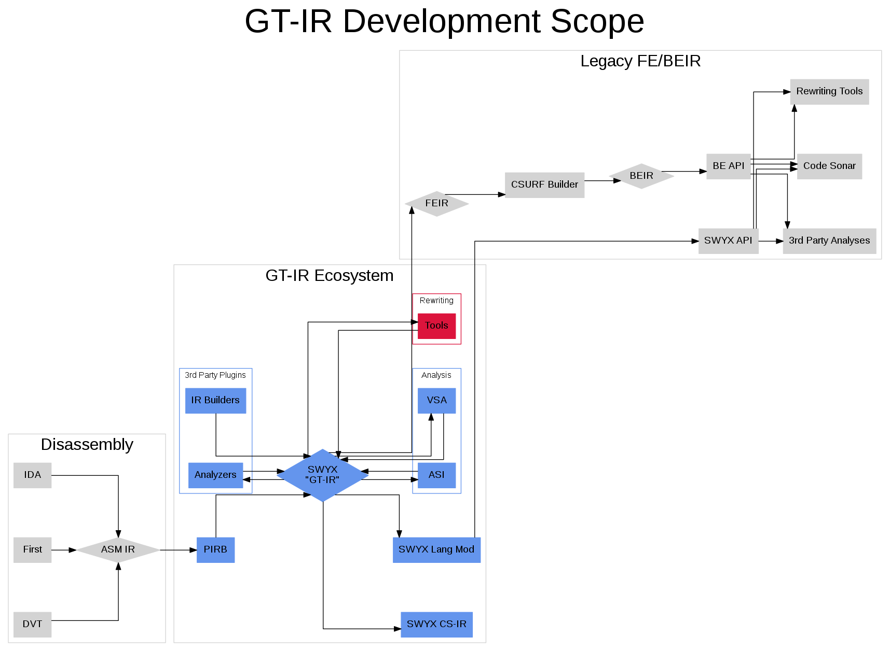
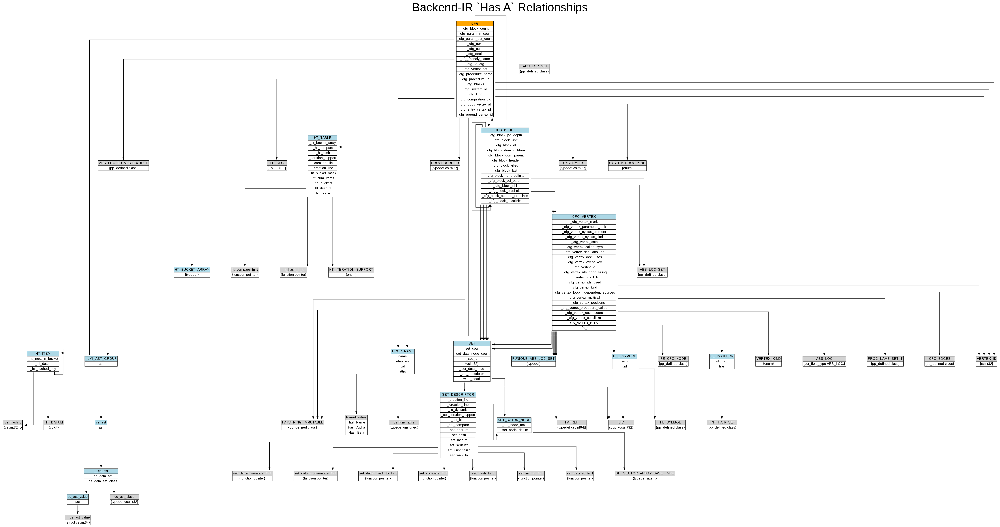
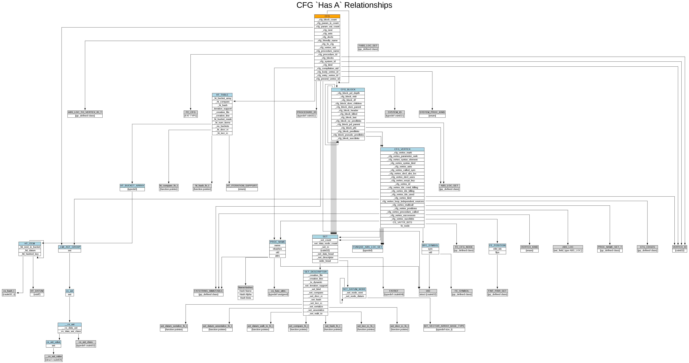
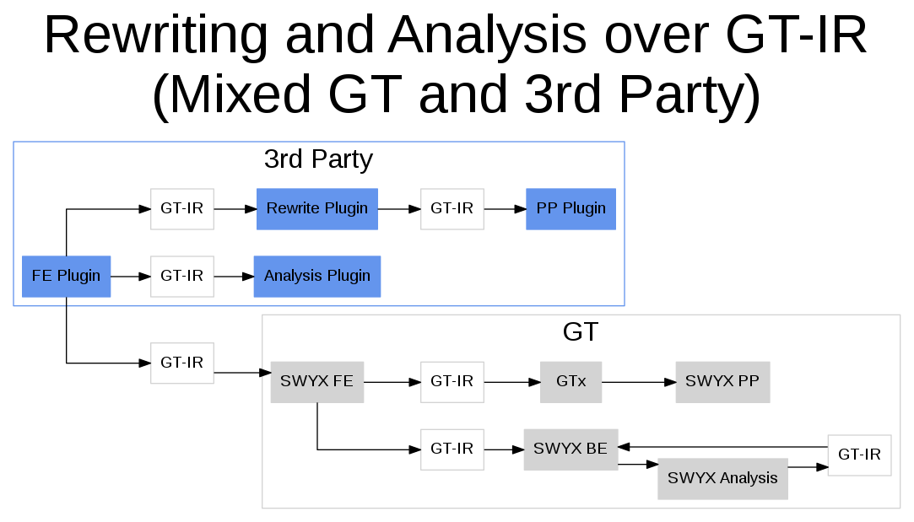
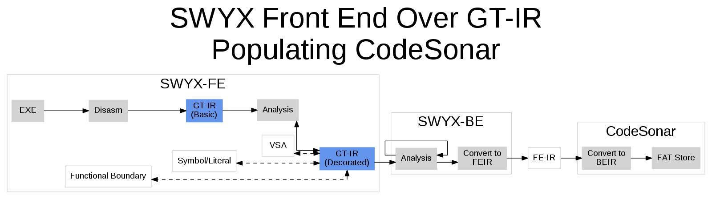
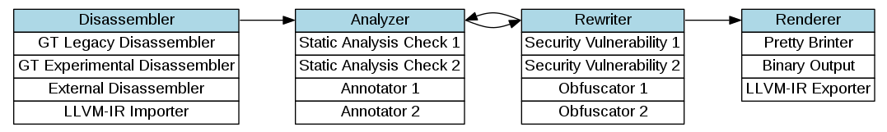
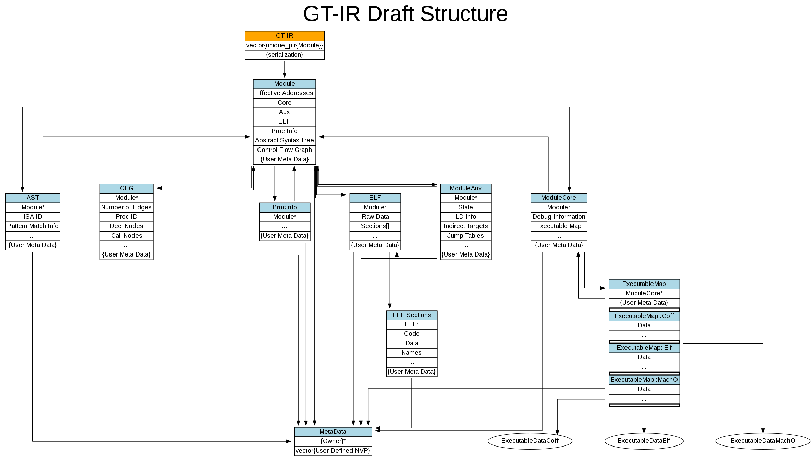

GT-IRB Road Map
===============

Executive Summary
=================

GrammaTech has a requirement to deliver a _binary code IR tailored for rewriting_ called GT-IRB. GT-IRB will be published and available for other performers (open source) to write front-ends, analysis tools, and back-ends against. GT-IRB will be based as much as possible on our existing CSurf/SWYX IR.

The goal of this document is to build consensus around the high level goals for GT-IRB and to explore trades among various paths for achieving those goals. Further, it lays out a viable path for implementing a GT-IRB architecture over a 12 to 18 month period.

The plan as outlined aims to build a library suitable for both commercial and research uses. It offers alternatives and options for various technical, process, and tooling decisions. The plan is focused not only on the pure technical requirements, but on laying the groundwork for a scalable code base built on a modern, robust core library: GT-IRB.

This is a road map, not a final plan or a detailed requirements document. The road map is designed to help ensure that all stakeholders are on the same page; that we are executing in a methodical way towards a set of articulated, measurable goals; and that we maintain an enterprise perspective while doing so. It is anticipated that this road map will be updated and modified as the project progresses. This also serves as a place to document the thought processes, ideas, and historical justification which can be later transitioned into formal documentation for the project. (Ideally, in ten years we might have a cohesive answer for “How did we get here?”)

Background
==========

Before detailing a plan for execution, we must first establish a baseline perspective on which we can build. First, we will organize around an agreed to set of goals for the GT-IRB project. Next we will do a brief survey of the technical debt that the GT-IRB project is inheriting. Finally, we can outline the general plan to reach the goals in light of the technical debt.

Much of the motivation for the approach here comes from our response to ONR-BAA\_N00014-12-S-B010:

> **1.3.5.2 Binary analysis and rewriting infrastructure**
> 
> A binary code IR tailored for rewriting \[Task TA5.1 Base\] GrammaTech’s infrastructure for binary rewriting shares GT-IRB with our CodeSurfer ® for Binaries commercial platform, which is already well suited for analysis, as shown in its commercial use. GT-IRB has also supported numerous successful research projects in binary rewriting, but with the experience we have gained from those projects, we see some ways in which GT-IRB could be further developed to tailor it for rewriting.
> 
> Some of the changes we plan to make to GT-IRB are motivated by flexibility for development and supporting good software engineering practices. GT-IRB will primarily use an efficient in-memory data structure, described below, but it will also have external forms that can easily be used by other tools and examined by tool developers: this will facilitate unit testing and debugging. Another benefit of an external representation easing interaction with third- party analysis and rewriting tools. This will support both collaboration and rapid prototyping. Finally, by basing all analysis, transformation, and compilation technologies on a unified GT-IRB the interleaving of transformation, re-analysis, and re-compilation is greatly simplified.

The benefits of the GT-IRB development span both business and project goals.

Business/Project:
- GrammaTech defined standard for Binary Analysis and Rewriting

Refactoring:
- Clearly defined IR API
    - Modular design moving forward
    - Separability of research projects
- Better physical design
    - Ease of development/maintenance
- Testability
    - Ease of development/maintenance
    - Improved reliability
- Standard language features
    - Improved performance
    - Ease of development/maintenance
    - Ease of training
    - Improved reliability
- Coding Standards in place
    - Ease of development/maintenance
    - Ease of training

> ### Special Note on the name "GT-IRB":
> This is actually the machine code representation (analogous to the LLVM-IR).  The name may change to something more descriptive such as _Machine Code IR (MCIR)_.  If a decision is made on this, documentation will be updated accordingly.  Consider _GT-IRB_ a _working title_. 

Scope
-----

### Document Scope

This documentation covers only the parts of the GrammaTech code base which are directly involved in the development of GT-IRB.  While the actual work scope is limited, many of the larger ideas are extrapolated to the entire code base merely to test their soundness.  By seeing how a specific idea might scale to the entire enterprise, we can better assess its ability to not only serve the needs of the GT-IRB, but also to serve as a model for future growth and development.

There are questions that naturally come up when reviewing this document.  Where possible, questions are directly addressed in revisions of this text as the document evolves.  There are some questions that are more difficult to address in this format.  For these, we have created a [FAQ](./gtirbFAQ.md).  This can serve as a place to document rational for various design decisions and grow to support developer, tester, and user questions as well.  Please refer to this document often and help expand it.

Research referenced throughout has been collected into a [Bibliography](./gtirbBibliography.md).  A more detailed discussion of [Software Engineering for GT-IRB](./gtirbSoftwareEngineering.md) has been developed as a companion to this roadmap.  There is also a whitepaper on [modernizing the DevOps environment](./gtirbEnterpriseDevOps.md) which could be prototyped during GT-IRB development.

### Work Scope

The scope of this work will be limited to ensure that the API portion is prioritized for satisfying the design principles and the first to benefit from modernized practices.  This roadmap will outline several phases of development.  At each phase, we will re-evaluate the goals and tasks for the next phase for mission creep to ensure the scope is maintained.

The proposed refactoring will be limited to the current SWYX/IR. (I.e., `ModuleIR` less `asmIR` which will be excised from `ModuleIR` before we begin).
- **In Scope** types of SWYX/IR.  broadly, the contents of `swyx/src/ir` but this also includes referenced types in:
	- `libswyx`
	- `tsl`
	- `csurf` (`NAST`)
	- some of `gtr`
- **Out of Scope** types used by SWYX/IR
    - FEIR and backend types
    - asmIR
    - most of `gtr`
- **Clients** which will require adjustment to the new IR
    - Primary: `swyx`, `terminus`, `tsl`, `vsa`
    - Secondary: `concolic` (uses TSL ASTs), `isal` (and possibly `isagen`), `libswyx`, `vertx` (uses TSL ASTs)

A diagram of the scope of the GT-IRB is provided below.  This shows the components which GT-IRB will likely directly modify (in blue) and parts which are in discussion (in red) and how they relate to the rest of the pipeline (black).



Goals & Requirements
--------------------

The purpose of this section is to ensure that everyone has the same understanding of the goals before we dive into tasks. Here, goals are defined as higher level concepts and aspirations versus pure program requirements. (Though some goals may also be requirements.) A requirement may be driven by contractual language and dictate overall success, while the goals are often implied by the requirements. Too often, there are unstated goals and requirements which influence decision making during execution. These should not continue to go unstated so that all parties involve understand the same big picture. Once documented, the goals should be used to guide decision making across the team at all levels. They will focus conversations and efforts.

There are three major areas that the goals and requirements aim to address: The physical design, the total surface, and development of an efficient representation. These address critical ongoing problems of development efficiency, development quality/safety, and execution efficiency which bog us down on research projects and which must be solved to field a maintainable product.

**Physical design**

GT-IRB will allow for improved physical design by providing a communication channel for separate logic components. This could go a long way to helping us address compilation costs.  The bounds of the physical re-design for GT-IRB will be fully explored and documented.

**Surface**

The current use of the ModuleIR by modules for communication increases the surface of the code, but has not been done in a generic, scalable manner. The GT-IRB should provide methods for general purpose access (or "surface") to our existing code. This will allow for (1) more efficient and effective testing, (2) ease of use of CSurf/SWYX into new prototypes and research projects, (3) more flexible execution, and (4) better interoperability with third-party tools.

Evan Driscoll and Dave Ciarletta both point this out as strongly desirable.

Evan Driscoll:

> the code isn't testABLE.
> 
> \[…\]
> 
> Ideally, what I'd have done is build some CFGs that get stored in a file, link against nCFG, load those, and run the tests on them. But the way the code is structured, this is effectively impossible.
> 
> \[…\]
> 
> Anyway, point being that I would very much advocate for having testability as a front-line goal.

Dave Ciarletta:

> Ten votes for this also… In fact, I'm actively looking for software developers that can help promote and instill testable design practices for the SQA positions we have posted. I'm happy in the interim to pull together some articles/training material of resources I have found useful to share on this topic if others are interested at this point.

This will also allow for new prototypes and research projects to leverage/extend CSurf/SWYX as a library without having to compile into and modify CSurf/SWYX core directly.

Currently, useless code is frequently compiled and run. Another benefit of an purposefully engineered physical design (E.g. the disk layout, file structure, and class structure) will be the eventual ability to interleave analysis and rewriting as GT-IRB to GT-IRB passes (currently re-analysis requires the "big loop" of creating a new executable on disk and re-ingesting from scratch with the front-end).

**Efficient IR representation**

Isolation of the core IR behind a well-defined specification will allow for experimentation with different IR representations. We expect that there is room for large reductions in our current memory and processing time requirements.

### Technical Goals and Requirements

(Strongly favor following the C++ Core Guidelines. References to the Core Guidelines are shown in this document inside parentheses. (E.g (CP.1)))

- Build a stand-alone GT-IRB suitable for use in internal and external projects; by internal and external parties.
  * The GT-IRB must serve a spectrum of API consumers.  Internally it will support research and product teams.  Externally, it will support other members of the Debloat team.
  * Leverage (to the extent possible) the existing CSurf/SWYX IR code base.
  * The GT-IRB should be considered *general purpose* for binary analysis and rewriting, but extendable to support highly specialized data produced by individual users.
  * The GT-IRB should be able to be leveraged by external organizations (even if it is not leveraged externally).
  * The GT-IRB should be suitable for open-source (even if it is not open-sourced).
- Build the GT-IRB as a self-contained data structure.
  * It contains no *business logic*.
    - It won't know how to decompile, analyze, or rewrite a binary.
    - It will have methods for manipulation, querying, serializing, etc.  (That is to say, it will not be totally void of functionality, but it will focus that functionality on the data structure.)
    - It may contain other data structures.  
      - There could be a severable chunk pulled off and called "AST" or "CFG", for example.
  * GT-IRB development may encompass the development of tools to work with the IR, but these tools should be a severable entity from the GT-IRB itself.
- Engineer a GT-IRB that is superior to the existing GT-IRB's (front end implemented as ModuleIR and the back end implemented as BE-IR) in use within SWYX and other GrammaTech tools.
  * Improve the logical design over our existing implementation.
  * Provide the ability to add custom plug-ins to the GT-IRB.
  * Ensure the GT-IRB is testable at the Unit, System, Integration, and Regression levels.
  * The anticipated GT-IRB will replace our existing CSurf/SWYX IRs seeking to stay as close as possible to what currently exists while also prioritizing minimization of the "core" IR to as small as possible while still supporting rewriting.
- Create a GT-IRB code base which is scalable to support the accumulation of software capital.
  *  Reduce maintenance costs.
  *  Uplift code to modern coding standards/practices.
  *  Reduce compile time.
  *  Improve physical layout.
  *  Make the code easier to scale with a purposeful design that anticipates changes and expansion.
- Plan for community growth and involvement.
  * Build a customer-friendly library.
  * Avoid customer confusion about which API they are using. (One GT-IRB.)
  * Make it simple to reason about the data structure, the objects.
- Produce and maintain customer-facing GT-IRB library documentation with minimal maintenance costs.
- Build a thread-safe GT-IRB library (CP.1).
  * Even if our suite of tools does not exploit thread safety, make a reasonable attempt at not subverting its use.
  * Basic thread safety does not imply additional overhead, but places constraints on how system resources are acquired and used. For instance, the use of static data within a function necessarily makes that function not thread safe because it maintains state.  This is not a proposal to integrate mutexes or similar constructs into the code, but to allow a user of the GT-IRB to be able to put such controls around its access and know that it is not sharing state amongst multiple instances of itself.

### Business Requirements and Goals

Beyond the technical goals, there may be goals which are more focused on GrammaTech as a company. By documenting these goals and their motivation, we can make better technical and investment decisions during the execution of GT-IRB development.

- Build industry acceptance of GT-IRB as the standard for binary analysis and rewrite work.
- Eliminate technical debt.
  * Instantiate processes to minimize its accumulation in the future.
  * We need more controls to ensure that research projects can leverage our capital without incurring too much debt.
- Build a strong enterprise of processes, tools, libraries which can be leveraged to turn intellectual capital into technical capital.
  * Evolving processes and tools should address the company’s growth and business targets.
  * The ecosystem for the GT-IRB can serve as a model for the firm.

Review of Technical Debt
------------------------

A (very rough) prototype GT-IRB was built from the existing code base. This was done, in part, to determine how much of the code base it touched and how expensive or technically challenging it would be to make various types of code changes.

The current GT-IRB structure was documented to visualize the logical design of the data structure. This illustration shows ModuleIR in orange. Complex data types are shown with blue headers, while basic data types are shown with gray headers. (This graphic is impossible to read at any normal resolution, but [the `.dot` file itself is provided for browsing](./dot/gtirbDataStructure_SWYXIR.dot) with a Graphviz-compatible application such as `xdot`.)






During these documentation activities, notes were taken at various points to help inform the challenges that would be faced during the creation of a well engineered GT-IRB.

These issues relate to current code properties which will directly impact the deployment and quality of the GT-IRB. They help inform the technical work which needs to be completed during GT-IRB development. This is not an all-encompassing list, but it demonstrates flavors/categories of problems which exist and are likely indicative of the types of problems which will need to be addressed in the production of a GT-IRB library. (The priority and severity is not addressed here.)

Each phase of development will work to pay off technical debt and, in the end, produce technical capital which can be leveraged on future development activities. Some of this debt directly impacts the ability of the GT-IRB to meet its goals. These lists are not intended to be complete, but examples of the types of issues which may seem ancillary to GT-IRB development, but can dictate its success or failure if they are not addressed. Examples of this include:

- **Code and tests that require environment variables.** - `GT_HOME` is an example of an environment variable which is assumed to exist and must be set properly.
- **Extensive use of globals preventing thread safety.** - A developer cannot reason about the code to determine if a given variable is global, a member, or local for lack of standardization. A developer should be able to assume globals are not in use.
  * Not obviously a global: `csuint32 fatobjs_num_stores;`
  * Source code comment: `Although global, these should be considered private. They are here for use by inline functions.`
- **Raw pointers being saved in STL containers.** - At a minimum this is a code smell. Worst case: there are memory leaks. (This is specifically addressed in one of Scott Meyer’s books on effective STL.) While not illegal, it is highly discouraged.
- **Pointer resource ownership is not clear**. - It is difficult to know who owns a resource and who is responsible for creating or destroying it. There are numerous examples of the same resource being pointed to by multiple objects, with no clear documentation of ownership.

Other debt impacts the ability to maintain the code. Maintenance can also impact the willingness for others to adopt the GT-IRB into their own code base. Examples of maintenance debt include:

- **There are include order dependencies.**
  * Examples are inside `module\_ir.cpp`.
  * The `gtr_config.h` and `lang.h` dependency order is pervasive.
- **The extensive use of macros in the code.** - Some of macros are are difficult to spot, define whole new types, and otherwise create _magic code_.
  * "hiding the macros in a header - as is not uncommon - makes this kind of _magic_ harder to spot.” - Stroustrup
  * `fImportTable_LGrip` was undefined. Is this a class? typedef? struct? `#define`? Where is this defined? There is no fImportTable project. Searching the code did not reveal it. It is defined by an evil macro `DECLARE_GRIP_TYPEDEFS(fImportTableEntry)`.
  * Some macros use other macros: `#define GTR_EXPORT extern GTR_DLLEXPORT`
- **The extensive use of typedef's.** - Typedefs, while promoting strong typing, obscures code/types/intentions (maintenance). Extensive use of typedefs make such a library very difficult (annoying) to integrate into other systems which use standard types
  * `FATOBJ_STORE`: Is this a pointer or object? A Macro? A Global? Who owns it?Who initializes it?
  * The GT custom `csuint64` vs. the standard `uint64_t` makes libraryintegration prohibitively difficult.
  * Redefinition of otherwise portable types makes code less/unportable toexternal users: `cs_size_t`, `cs_boolean`
  * `typedef struct _dictionary *DICTIONARY;`
- **Extensive creation of uninitialized variables (even globals).** - This breeds undefined behavior non-deterministim.
  * `size_t fatobjs_cache_size;`
- **Macro and variable names that are neither sufficiently unique nor protected inside of a custom namespace.** - They could very easily conflict with existing user code.
  * `NOT_FOUND` in `lang.h`.
- **A myriad of conventions and standards makings moving through the code difficult.** - From file names, to class names, to variable names: there is no discernible pattern or preference when reviewing the code. There should be not only a standard, but a methodology for naming things such that one can reason about a thing’s purpose given only its name. Consistency in naming will free up developers to think about more important things while making it easier to locate and understand code.
  * `module_ir.cpp` defines a class `ModuleIR`
  * There are examples of patterns such as: `foo/gtfoo`, `gt_foo/foo`, `gtfoo/gt_foo`, etc.
  * There are examples of patterns such as: `foo_exp.h`, `foo_decl.h`, `foo.h`, `gt_foo.hpp`, `foo_pgm.c`, `exe_foo.c`, (`set_unique/su.h`)
  * Some member variables are prefixed with an underscore in violation of the ISO C++ standard.
  * Formatting has been done by hand and can vary significantly among various parts of the code base. Some of this is inconsistency makes knowing even the intent of the code difficult.
  * Most classes seem to lack any documentation of purpose. Many of the comments are useless and provide no value add.

The Technical Path
------------------

\[This section is in development\]

There are three technical paths which were considered in the outline of this plan. Each of them have drastically different technical ramifications, complexities, and costs.

### Path 1: Build the GT-IRB Utilizing Both ModuleIR and Back End IR (BE-IR)

This is viewed as the technically superior path. Conceptually, this path would build a new GT-IRB where the BE-IR is the base implementation and the capabilities of ModuleIR are rebuilt on top of it. This would likely require changes to the BE-IR which would impact CodeSonar. 

If the IR were something to be targeted by external customers, it would be ideal to be able to provide full source for the GT-IRB itself.  This would allow others to better write custom tools targeting it, contribute to the testing, and even provide optimizations and enhancements.  This added involvement would foster more of a sense of ownership by those that use it and encourage them to continue doing so.  However, if we built on top of the Back End IR, we would not be able to provide _source_.  There is a great deal of proprietary business logic built into the BE-IR that we would not want to hand out.  We could provide a binary- only solution with header files.  This would still require some degree of re- engineering because it was not designed to be delivered as a library in this fashion.  Being able to isolate the implementation from the API would be a significant amount of work. Further, we would be responsible for building and debugging it on every platform that consumers would want to use it on, adding to the maintenance costs.

The BE-IR was not designed to have its components independently constructible. That would make it hard for consumers to add new features and capabilities, harder to test, and ultimately impede adoption.

Utilizing the BE-IR would also be the most technically challenging. At its core, the technical effort would have to take two libraries which have been custom engineered to serve two different purposes and weld them together in an elegant fashion. When successful, however, the total cost of maintenance for both the research and product sides of GrammaTech would be reduced. We would also have the benefit of being able to present a single API to external customers.

Total Time Estimate: 36 Months, Risk: High

### Path 2: Build the GT-IRB Utilizing only ModuleIR

**This is viewed as the most cost-effective path. As such, it is the one we have chosen to explore within this road map (though Path 3 could easily be incorporated as well).**

This path would have us modernize the `ModuleIR` and `AnalysisEnvironment` before doing a deeper re-engineering on it, ultimately producing the GT-IRB. Technically, this is the most straight-forward approach. It does, however, leave us with two IR’s to present to external customers: GT-IRB and BE-IR. While this would preclude GT-IRB from directly leveraging the engineering and optimization investments into the BE-IR, it would allow GT-IRB to experiment with its own in- memory formats. Further, it would allow the GT-IRB to develop its own optimizations for a more focused-use case: binary rewriting.

Following this path, the GT-IRB would be used to communicate betwween various internal and third-party components.  It would be a common object, self contained, that could communicate information without the need for a monolithic code base.  An example of how data could flow among various internal and third-party components is shown below:



The GT-IRB would also interface with CodeSonar in much the same way.




Total Time Estimate: 18 Months, Risk: Medium

### Path 3: Build the GT-IRB Utilizing only ModuleIR and an API Common with GT-IRB and BE-IR.

This is likely the most pragmatic path. By leveraging the same reasoning behind Path 2, this path allows the development of an API which can be shared by both IR’s later in development. As the GT-IRB is matured, decisions can be made on its technical direction which lend themselves to the creation of such an API. We can also decide that the cost or risks associated with the API are too great much later in the development and not expend effort on what may be a technically challenging or costly activity. The success of the project would not rely on the API being successful, but a successful development of the API would add to the overall utility of both the GT-IRB and the BE-IR.

Total Time Estimate: 24 Months, Risk: Medium

The Phased Approach
-------------------

This document lays out a series of phases to be executed in order to complete the GT-IRB. The completion of each phase is measurable and constitutes a working “product”. (At the end of a phase, all code should compile, run, pass tests, and demonstrate meaningful progression towards our goals.) Each phase is laid out into two sections to focus on specific tracks of development: Technical, and Processes. (See [GT-IRB Software Engineering](./gtirbSoftwareEngineering.md) for additional detail on technical work which can be woven into these phases as well as a discussion of supporting tooling and testing procedures.) Each phase will require refinement and details prior to execution, but this document is an attempt to provide a framework for future discussions.

The _Technology_ track is focused on reaching the hard technical goals and requirements. Sometimes, options will be presented which help achieve technical goals in different ways or help achieve different business goals to supplement hard technical requirements. Some of the technical tasks relate to code modernization. It is important to put this into the correct light:

> “The purpose of modernizing code is to simplify adding new functionality, to ease maintenance, and to increase performance (throughput or latency), and to better utilize modern hardware. Making code "look pretty" or "follow modern style" are not by themselves reasons for change. There are risks implied by every change and costs (including the cost of lost opportunities) implied by having an outdated code base. The cost reductions must outweigh the risks.” - Cpp Core Guidelines

The _Processes_ track focuses on how work gets done (not only on this task, but within the company into the future). As GrammaTech grows and the complexity and breadth of the code base increases, processes used for software development and maintenance should necessarily adapt. Process improvements will help achieve both technical and business goals in a more scalable fashion.

These efforts would encompass only the GT-IRB work initially, but the plan would be to migrate the enterprise to a more purposeful system for manging code, protecting intellectual property, testing, verification, and documentation. There are (admittedly) ancillary tasks and suggestions contained herein. They are included because it will be necessary to address larger issues relative to scaling both the code base and the team.

| Phase 1                                                                                                        | Phase 2                       | Phase 3                                                        | Phase 4                                                          | Phase 5                                                                               | Phase 6                                                                                                                       |
|:---------------------------------------------------------------------------------------------------------------|:------------------------------|:---------------------------------------------------------------|:-----------------------------------------------------------------|:--------------------------------------------------------------------------------------|:------------------------------------------------------------------------------------------------------------------------------|
| Initial Refactoring                                                                                            | Re-Engineering                | Code Modernization                                             | Standard Types                                                   | Modularization                                                                        | Open Source Deployment                                                                                                        |
| ~4-6 Weeks                                                                                                     | ~25-36 Weeks                  | ~6 Weeks                                                       | ~10 Weeks                                                        | ~12-24 Weeks                                                                          | ~8 Weeks                                                                                                                      |
| Technical debt reduction; Non-breaking changes; Minimal impact on client code; Procedural and tooling changes; | Major data structure changes. | Code Modernization; Some structural changes; Improved testing; | Replace the FAT store with standard types in the implementation. | Develop custom utilities such as a pretty printer and an LLVM conversion application. | Policies for open source are established; Documentation is completed; Training is built; The final GT-IRB library is deployed; |

Once each of these phases is refined into specific and measurable tasks, they should be broken into one or more sprints as defined by our Agile processes. The code base impacted by each phase will be uplifted to compile and pass tests. That is, at the end of each phase the goal is to have a complete working code base. (Longer phases should be designed to have several synchronization points where the whole code base is up-lifted and re-tested.) This should help to prevent GT-IRB development from diverging too greatly from the rest of the projects in development.

### The Big Bang Development Approach

As an alternative to the phased approach proposed here, I also considered the impact of simply starting from scratch. There are a number of clear advantages to this approach. Not only would it build from a clean code base without inheriting any technical debt, it would also start with fresh tools and processes free of any baggage from past efforts. Further, it would likely be faster (and less costly) to develop the GT-IRB in this way. However, this approach is not put fourth because of the significant down-side: reintegration and testing.

There would be a measurable effort to move the existing code base to the new GT-IRB all in one go. Development would basically have to stop across the code base to focus on integrating the new GT-IRB before work could continue. This would breed cultural distrust of the new library as it would universally (negatively) impact virtually every developer in the company. There would likely be a great deal of distrust (organizationally) with the new, unproven, GT-IRB (and rightfully so).

I estimated that the time that is saved in the initial development of such a GT-IRB would be offset by an increased amount of time in the maturation of testing. (Not that this is entirely negative from a technical perspective.) The testing regime would have to be significantly altered (if not replaced entirely), which would make it hard to build solid regression tests.

If this, however, seems like an acceptable risk then this idea can be developed further. Task phases and estimates could be matured so a more objective comparison of the two approaches could be considered. There are real positive changes that a “from scratch” development could promote.

Phase 1 - Initial Refactoring
=============================

| Summary                                                                                                        | Time Estimate |
|:---------------------------------------------------------------------------------------------------------------|:--------------|
| Technical debt reduction; Non-breaking changes; Minimal impact on client code; Procedural and tooling changes; | ~4-6 Weeks    |

The first phase of the plan will focus on non-breaking code organization to lay the groundwork for future phases. The changes will not be functional within the code, but begin to condition the code base to leverage a completely independent GT-IRB project which consists entirely of existing components.

The code leveraged by GT-IRB is spread across many projects in the existing code base. 

Technical
---------

Each task is focused so that it can be started, completed, and tested on a single branch and the time to do so is measurable. It is in rough order of execution and priority.

### Clean up `#include` for in-scope Classes

Use clang's `include-what-you-use` to help clean up the include paths from header and implementation files.  Files containing multiple class/struct definitions may be broken down into independent files to help with encapsulation.  Some inline implementation may be moved to implementation files.  The PIMPL idiom may be selectivly applied to hide heavy-weight implementation details.

### Segregate the code base required for stand-alone GT-IRB

GT-IRB must stand on its own as a library. This is going to impact a great number of files and projects. Start by segregating the code we will be working on into an appropriately organized unit. This is going to touch many projects. Complete this task first so other work can progress without constantly impacting these projects.

1.  Establish a namespace for the IR and move code the IR _owns_ into this namespace.  This will also serve to mark code that uses (consumes, modifies, etc.) the IR.
2.  Some layout changes within the GT-IRB library may take place (Mainly file paths, relative paths, etc.)

### Code Style Adherence

Apply a uniform and enforcable style to all IR code utilizing `clang-format`.  This work will be done on all code in the IR's namespace and done in a single commit.

Processes
---------

### Explore Use Cases

Establish several meetings to focus on working through use cases of the GT-IRB.  For each case, explore specific aspects of the internal and external representation of the data and how it is accessed.  Use cases should be decided before the meeting and participants should arrive having had time to think through not only technical details, but how the entire GrammaTech ecosystem would be impacted.  Example questions to answer would be:
  - How would CodeSonar be impacted?
  - What would be the impact to rewriting customers?
  - How would a new disassembler be integrated?
  - How would a new analysis be developed?

### Establish a Scrum

Following the firm’s established Agile processes, instantiate a scrum schedule specifically for GT-IRB development.

### Build Metrics/Success Criteria

We must look forward and establish the metrics by which to measure success and failure of the next phase of development. This should be documented and help inform the requirements and time line for future development. Each task should be related to a requirement or goal. If this thread cannot be established, then the task should be shelved for another project to address. Then each of these tasks must be documented along with assumptions, time estimates, and rough priority. The metrics for the phase should be codified and communicated to all concerned parties.

Run precision tests after every phase.  Establish a view in Team Process to display longitudnal performance data.  

### Analyze Options for TSL

Should any changes to TSL be rolled into this effort?  If not, then should we consider how TSL might evolve to help inform design decisions today?  Could TSL evolve into being more like Lex/Yacc/Flex/Bison (vs a completely pre-ran paradigm)?  Where does TSL go physically?  Should instruction AST's be their own data structure?  How would changes impact Grace?

### Hard Requirements Development

There are several areas that will require requirements and goals to be defined and refined. During this phase, begin to sketch what additional requirements areas will need defined for each subsequent phase. Additionally, look to these phases and see where there are gaps and omissions. While we cannot get drowned in process, we must also ensure that everyone has a clear and common vision for where we are going.

### Future Requirements Development

Some amount of time should be dedicated to looking forward and seeing where we may want this library to be in a one year, five year, or ten year time frame. (For example, we may not currently support MIPS or OSX, but we see a need to eventually support them. Or we may want to have a framework in place to position ourselves for an upcoming contract. How might these impact our design decisions if it was a requirement today?) These can help guide and inform design decisions. We may be able to take steps to not preclude a feature from being implemented in the future or even help its development when the time comes.

### Obsolescence Audit

Do a review of our underlying reliance on external technologies. Are there tools, libraries, or significant assumptions that are now obsolete? Are our externally supported tools or libraries still supported (in active development) or are there more modern tools and libraries that we should be using?

### Review the Disaster Recovery Plan

Review and verify the disaster recovery plan. Given the large volume of work that is being done, we must ensure that we are reasonably insulated from data loss. Ensure that backup solutions are in place, that we will be working in environments that are backed up, that there is an off-site backup plan, etc. Review policies for pushing code up to servers vs. having copies only on local machines, etc.

### Evolve Documentation

As classes are developed and modified, transition them to use the _Doxygen_ standard for documentation.  Work towards having the IR's public API completely documented with preconditions, postconditions, funcional descriptions, input variable definitions, and output definitions.

Phase 2 - Code Re-Engineering
=============================

Phase 2 is where the technical heavy lifting is done. There will likely be many breaking changes to the existing code base as GT-IRB is re-engineered from structural and functional perspectives. GT-IRB’s data structures will be re-engineered to better address the types of uses we need today and built to be expandable. The aim is to have a GT-IRB that is adaptable to our (and others) future requirements with minimal to zero impact on compliant code. It is in Phase 4 where we finish paying off our debts and start building technical capital.

The GT-IRB will function like a plug-in architecture.  There will be defined pieces with sharp API's so that various stages can be developed independently, chained together arbitrarily.  The exact boundaries and API's must be defined. An example of this architecture and how the core components could communicate is shown below.



Each of these units is its own functioning entity (i.e. its own dynamic library or micro-service). Importantly, each is using a well engineered base class such that we have interchangeable parts.  The common language between them is the GT-IRB.

The GT-IRB itself would be assembled from a better arrangement of mostly existing code.  The structure should be fully documented, but a draft of the type of structure to be engineered is shown below.



The _Disassembler_ stage could be a GT disassembler or another 3^rd party tool. It would create a compliant GT-IRB data structure which could be passed to an _Analyzer_, _Rewriter_, or _Output_ stage.  The GT-IRB could go through any number of analysis and rewriting steps before it is written back out (E.g. through a pretty printer or to a binary).  We would then be able to write and test analyzers, for example, that are completely independent of the rest of the code. We would be able to chain together these services virtually arbitrarily. This would also allow us to inject debugging or testing before or after any core component, allowing for much more fine-grained level without inducing the need to create a monolithic application or spend hours recompiling in the process.

Technical 
----------

Each task is focused so that it can be started, completed, and tested on a single branch and the time to do so is measurable. They are listed in rough priority based on the order they should be completed to feed into the next task. (Though some may be done in parallel, managing merge conflicts can be difficult on a code base of this size with multiple developers touching the same parts of files.)

### Replace `AnalysisEnvironment`

A single `ModuleIR` contains the IR for only one binary (E.g. a `.o` file).  To look at an entire binary, one must use the `AnalysisEnvironment`.  Currently, `AnalysisEnvironment` is used to group together multiple ModuleIR's.  Unfortunately, the implementation leverages a global _knowledge database_.  The use of the global must be eliminated.  GT-IRB's would begin as an independent structure which encompasses the capabilities of `AnalysisEnvironment` without requiring a global variables.  

Existing code would be re-factored for the first time to use the `gtirb::IR` class in place of the `AnalysisEnvironment`.  On this, further restructuring would be built towards the goal of a complete GT-IRB implementation.

### Segregate the Business Logic from the Data Structure

See [_GT-IRB Software Engineering - Segregate the Business Logic from the Data Structure_](./gtirbSoftwareEngineering.md).

### Eliminate all global (and static) variables (I.2, R.6)

See [_GT-IRB Software Engineering - Eliminate all global (and static) variables (I.2, R.6)_](./gtirbSoftwareEngineering.md).

### Eliminate all singletons (I.3) (Except where you can’t) 

See [_GT-IRB Software Engineering - Eliminate all singletons (I.3) (Except where you can’t)_](./gtirbSoftwareEngineering.md).

### Re-Engineer the Architecture Where Appropriate

This is the most invasive restructuring that the project will see. It needs detailed requirements and its own subset of goals. Some guidance to start the conversation includes:

- Encapsulate messy constructs (P.11).
- Build scalable data types to support currently unknown requirements. For instance, allow for anything inheriting from a base type such as “IRNode” to have any number of arbitrary “IRNode” children irrespective of their underlying type. Or allow for arbitrary “IRMetadata” children.
- Ensure that the organization of the data is logical and can be reasoned about.

- Integrate solid design patterns. There are hints of design patterns in use in various parts of the code base. Versus allowing a kitchen-sink approach, pick the correct design pattern (or very small subset of patterns) that will inform the design. For instance, if a developer knows that the GT-IRB supports the Visitor pattern, then they can immediately make a whole host of assumptions about how it works and understand how to access nodes, mutate data, etc. implicitly.

- Eliminate duplicate data. There are many objects that point to a piece of their parent’s data. (E.g. References to _owning_ `ModuleIR`). 
  * “Repetition leads to inconsistency and code that is subtly broken, because you changed only some repetitions when you needed to change all of them. Often, it also means that you haven't properly thought through the organization of your code.” - Eric Steven Raymond

### Remove all malloc/free Calls in the Code Base (R.10, R.22, R.23)

See [_GT-IRB Software Engineering - Remove all malloc/free Calls in the Code Base (R.10, R.22, R.23)_](./gtirbSoftwareEngineering.md).

### Remove all Naked new/delete Calls in the Code Base (R.11, R.22, R.23)

See [_GT-IRB Software Engineering - Remove all Naked new/delete Calls in the Code Base (R.11, R.22, R.23)_](./gtirbSoftwareEngineering.md).

### Improve the Physical Layout

Where appropriate, implement the PIMPL idiom within classes. ([I.27](https://github.com/isocpp/CppCoreGuidelines/blob/master/CppCoreGuidelines.md#Ri-pimpl)) This will insulate consumers of the library from more invasive internal changes both in subsequent phases as well as after deployment. This will also have the benefit of reducing dependencies and improving compile times. (This will be effected by reducing header load and preventing recompilation entirely when implementation details change.)

See [_GT-IRB Software Engineering - Improve the Physical Layout_](./gtirbSoftwareEngineering.md).

### Build a Strong Unit Test Suite

See [_GT-IRB Software Engineering - Build a Strong Unit Test Suite_](./gtirbSoftwareEngineering.md).

### Implement an Error Handling Strategy

Integrate an engineered error handling strategy ([E.1](https://github.com/isocpp/CppCoreGuidelines/blob/master/CppCoreGuidelines.md#Re-design)) that clients of the library can rely on for reporting.

### Explore a More efficient AST representation

\[This section is under development.\]

### Revisit the symbol representation question (fSymbols)

\[This section is under development.\]

### Evolve Documentation

As classes are developed and modified, transition them to use the _Doxygen_ standard for documentation.  Work towards having the IR's public API completely documented with preconditions, postconditions, funcional descriptions, input variable definitions, and output definitions.

Processes 
----------

### Metrics Development

We must look forward and establish the metrics by which to measure success and failure of the next phase of development. This should be documented and help inform the requirements and time-line for future development. Each task should be related to a requirement or goal. If this thread cannot be established, then the task should be shelved for another project to address. Then each of these tasks must be documented along with assumptions, time estimates, and rough priority. The metrics for the phase should be codified and communicated to all concerned parties.

### Evaluate the GT-IRB / BE-IR Common API

Once the design of the GT-IRB is under way, it will be easier to evaluate the development of a single API which can serve both GT-IRB and BE-IR. This is a highly desirable feature to support. GT-IRB design decisions can be informed by this goal. The total engineering effort, benefit, and cost can be better evaluated once the GT-IRB technical effort has matured to this point.

### Library Documentation

Significant changes will likely be made to the GT-IRB during this phase. As code is modified, document preconditions (I.5, I.6, E.7) and postconditions (I.7, I.8, E.8) for function calls in the API. It is critical that this is done for any code that a consumer of the library would interact with. It will also aid in future maintenance of the library.

Class documentation should be built explaining the purpose for the class and how it relates to the rest of the GT-IRB. A comment style such as that defined by Doxygen should be utilized so that the project can build automated API documentation in the future.

### Postmortem

Conduct another postmortem on the previous phase. Feed the lessons learned into this phase. Pay special attention to the types of problems which were not anticipated. The types of build errors that were recurring. What are the patterns that are emerging? What was the root cause of the problem? How do we start to address the problems going forward through the use of policy, procedures, tooling, and staffing?

Phase 3 - Code Modernization
============================

| Summary                                              | Time Estimate |
|:-----------------------------------------------------|:--------------|
| Clean up the code base through non-breaking changes. | ~6 Weeks      |

The focus of Phase 3 is to clean up the newly independent code base and take care of low-hanging fruit.  Without impacting projects externally to the GT-IRB to any significant degree, code cleanup will lay the foundation for later phases by concentrating and focusing the development efforts on specific, measurable activities. Generally, these changes do not impact the API but do improve ISO C++ compliance, improve memory utilization, and fix or prevent subtle bugs which would impact future phases.

Because “code modernization” is very vague, very specific technical tasks are laid out here which will have the most positive impact on the GT-IRB code base. Each task is focused so that it can be started, completed, and tested on a single branch and the time to do so is measurable.

Technical 
----------

All changes (or types of changes) will be documented. While a detailed study should be completed in Phase 1, tasks proposed here are as follows in a rough order of priority:

### Compile all GT-IRB `C` code as `C++` Code

Ensure that, wherever possible, C++ compilers are being used for the C code as well.

> “If you must use C, use the common subset of C and C++, and compile the C code as C++. That subset can be compiled with both C and C++ compilers, and when compiled as C++ is better type checked than pure C.”* - ([CPL.2](https://github.com/isocpp/CppCoreGuidelines/blob/master/CppCoreGuidelines.md#Rcpl-subset))

While always situation dependent, this does not mean that the existing C code must be rewritten (There are roughly 12,267 C files that could be impacted across our libraries). Benefits are gained immediately by using C++ compilers. The cost/benefit of rewriting individual pieces of C code must be determined on a case-by-case basis.

### Replace Owning Raw Pointers with `std::unique_ptr` to Enforce Ownership

Future phases will work on reorganizing and re-engineering the way the GT-IRB is structured. The true owners of data must be explicitly enforced. If this is done in the current structure, then this ownership will inform the new structure and migration to it. ([R.2](https://github.com/isocpp/CppCoreGuidelines/blob/master/CppCoreGuidelines.md#Rr-use-ptr), [R.3](https://github.com/isocpp/CppCoreGuidelines/blob/master/CppCoreGuidelines.md#Rr-ptr), [R.20](https://github.com/isocpp/CppCoreGuidelines/blob/master/CppCoreGuidelines.md#Rr-owner), [R.21](https://github.com/isocpp/CppCoreGuidelines/blob/master/CppCoreGuidelines.md#Rr-unique))

### Integrate Modern Language Features and Patterns

Re-implement any remaining classes with the PIMPL pattern.  Utilize smart pointers to enforce ownership.  Replace hand-rolled loops with standard algrithms.  Explore the possibility of using a tool such as `clang-tidy` to help with modernization.

### Evolve Documentation

As classes are developed and modified, transition them to use the _Doxygen_ standard for documentation.  Work towards having the IR's public API completely documented with preconditions, postconditions, funcional descriptions, input variable definitions, and output definitions.

### Resolve the `__declspec(dllimport)` Headache

\[This section is under development.\]

Processes
---------

### Enforcement through Tooling

Implement procedural and tooling changes.  Provide tests to run before commits (automated with GitLab).  Test if automatically running `clang-format` is feasible and desireable.  

### Postmortem

Conduct a postmortem on the previous phase. Feed the lessons learned into this phase. Pay special attention to the types of problems which were not anticipated. The types of build errors that were recurring. What are the patterns that are emerging?  Are we suffering from mission creep?  How will we know during the next phase if we are suffering from mission creep?  What was the root cause of the problem? How do we start to address the problems going forward through the use of policy, procedures, tooling, and staffing?

### Metrics Development

We must look forward and establish the metrics by which to measure success and failure of the next phase of development. This should be documented and help inform the requirements and time-line for future development. Each task should be related to a requirement or goal. If this thread cannot be established, then the task should be shelved for another project to address. Then each of these tasks must be documented along with assumptions, time estimates, and rough priority. The metrics for the phase should be codified and communicated to all concerned parties.

### Community Input

Contractually, we are required to produce GT-IRB for use by other Debloat team members. Consider soliciting requirements (or desirements) from these potential external users of the GT-IRB. While this may reveal strong preferences and great feature ideas, it may also engender trust and eventual adoption of the GT-IRB library by these external organizations.

Consider running a red team to see where problems in the design exist. What would we think detractors would say about the design, testing, or documentation?

Phase 4 - Standard Types
========================

| Summary                                                                       | Time Estimate |
|:------------------------------------------------------------------------------|:--------------|
| Use standard types where appropriate and remove the FAT store from the IR.    | ~10 Weeks     |

Phase 4 will focus on cleaning out the code base and eliminating technical debt. It will leverage the work done in previous phases building out the GT-IRB as stand-along project with a dedicated testing architecture. This phase will introduce some more invasive changes, laying the foundation for the modularization in Phase 5.

De-obfuscation will be one of the primary goals of this phase.  By reducing redirection, renaming, and excessive use of `typedef`, we will be better prepared for re-engineering the architecture.  This phase will see some reduction in the total number of types and more explicitly spelled concepts.  IN the end, we will have fewer object types to manage and more use of standard types (E.g. STL) to leverage during Re-engineering in the next phase.

In the execution of Phase 3, we are ensuring that we have done what we can to move towards our goals without breaking the codebase itself. We will further improve the testing and have processes in place to manage the change that will be introduced in the re-architecture in Phase 4.

Technical 
----------

Each task is focused so that it can be started, completed, and tested on a single branch and the time to do so is measurable. They are listed in rough priority based on its impact to quality, maintainability, and preparation for more invasive re-engineering in the next phase. (Any of these technical tasks may be skipped for files/classes which we anticipate will be eliminated in later engineering work.)

### Establish and Enforce File Naming Conventions

Start at user-facing code and work inward. Establish a 1:1 class declaration (`.h`) to class definition (`.cpp`) ([SF.1](https://github.com/isocpp/CppCoreGuidelines/blob/master/CppCoreGuidelines.md#Rs-file-suffix), [SF.2](https://github.com/isocpp/CppCoreGuidelines/blob/master/CppCoreGuidelines.md#Rs-inline)). There is a volume of work here, but it is not difficult work. It will have an impact to the `#include` files in external projects, but these types of transformations are easily automated.

### Perform Additional Modernization

See [_GT-IRB Software Engineering - General Code Modernization_](./gtirbSoftwareEngineering.md).

### Eliminate the FAT Store within GT-IRB

Elimination of the _FAT_ (and _thin_) concept and supporting classes is not technically required, but it is highly recommended. The goal with eliminating this is to streamline the GT-IRB library, reduce its footprint, make it more scalable, reduce its complexity, and improve runtime.

The FAT is currently provides the on-disk serialization for the GT-IRB library. This can be supplanted in simpler, more portable ways using modern libraries such as Cereal or Boost Serialization. We may experience both improved compilation times as well as improved runtime by moving to one of these more standardized solutions. We will no longer have to support so many custom types as standard library containers can be serialized directly. This work will eliminate a source of bugs while providing us ways to allow the compiler and test suite to support enforcement of serialization requirements.

Perhaps most importantly, moving to a more generic serialization solution will make it easier for users to extend GT-IRB with custom types and meta-data in the future. This moves us towards the goal of making the library scalable and more easily adopted by future requirements and external parties.

### On-Disk Serialization

From our technical proposal:

> “GT-IRB will primarily use an efficient in-memory data structure, described below, but it will also have external forms that can easily be used by other tools and examined by tool developers: this will facilitate unit testing and debugging. Another benefit of an external representation easing interaction with third-party analysis and rewriting tools. This will support both collaboration and rapid prototyping.”

**Binary**

If the FAT concept is eliminated, an efficient binary format would be built into the re-engineered data structure. Candidate support libraries include Cereal and Boost Serialization. Both of these offer out-of-the-box binary formats for storage.

**XML**

Utilizing much of the same infrastructure for the binary on-disk serialization, we could optionally develop a custom XML schema to which would support serialization. This representation would be suitable for backward compatibility (as a binary’s ABI could change), data visualization, and tool development.

**ASCII**

Another approach may be to develop our own plain text language, similar to LLVM’s IR. This would be more compact than an XML representation, but we would also have to implement and maintain our own parser.

**JSON**

Output JSON which is highly portable.  This is directly supported by ```boost::serialization```.

Processes
---------

We must look forward and establish the metrics by which to measure success and failure of the next phase of development. This should be documented and help inform the requirements and time-line for future development. Each task should be related to a requirement or goal. If this thread cannot be established, then the task should be shelved for another project to address. Then each of these tasks must be documented along with assumptions, time estimates, and rough priority. The metrics for the phase should be codified and communicated to all concerned parties.

During this phase, we should come up with more solid design requirements and perhaps even prototype ideas for the re-engineering to be completed in the next phase. Detailed technical requirements should be developed and entered into the issue tracking system.

### Consider Binary Representation

In the next phase of the work, there will be considerable change. This will be the time to implement a long-term solution for a binary representation.

The representation of the IR in memory is not defined by the specification. Initially we will simply continue to use a reduced version of our existing data structures internally. After our initial conversion to the specification we plan experimentation with other representations with improved non-functional properties. (The ability to experiment with different representations is sorely needed, but impossible now given the lack of a standard API.) The most likely long-term representation will be to continue using a reduced version of our existing data structures with or without the FAT store. Some extreme options discussed in design meetings include: binary machine-code (actually using the same representation used to store instructions in machine code, with additional flags or meta-information; which would be maximally compact), a relational database (providing a rich set of external tools and significant work optimizing memory/disk caching), or even a datalog database.

### Code Base Maintenance Plan

With any measurable change to the GT-IRB structure, there will be a significant impact on existing code. We will have to make a decision as to how to proceed with respect to upgrading, rewriting, and maintenance. Up through this phase, changes have been such that maintenance to the existing code base has either been minimal, or easily automated and verified. The next phase will likely be the largest technical and management challenge in this entire process and incur the most risk. How will we manage the risk, balance workloads, and ensure success?

### Evolve Documentation

As classes are developed and modified, transition them to use the _Doxygen_ standard for documentation.  Work towards having the IR's public API completely documented with preconditions, postconditions, funcional descriptions, input variable definitions, and output definitions.

### Postmortem

Conduct a postmortem on the previous phase. Feed the lessons learned into this phase. Pay special attention to the types of problems which were not anticipated. The types of build errors that were recurring. What are the patterns that are emerging? What was the root cause of the problem? How do we start to address the problems going forward through the use of policy, procedures, tooling, and staffing?

Phase 5 – Modularization
========================

| Summary                                                                       | Time Estimate |
|:------------------------------------------------------------------------------|:--------------|
| Build/extract stand-alone utilities.                                          | ~12-24 Weeks  |

This phase is defined and driven by both GrammaTech and TPCP community needs.  

Technical
---------

### Build a GT-IRB to Assembler Pretty Printer

### CodeSurfer Integration & Testing

The integration of GT-IRB into CodeSurfer is contractually required. From our technical proposal:

> GTx’s only required commercial component is CodeSurfer for Binaries, which
> provides the foundation of GrammaTech’s capabilities for binary analysis and
> rewriting.

### GT-IRB to LLVM-IR Conversion Utility

Build a tool which verifiably translates from GT-IRB to LLVM-IR (and possibly from LLVM-IR to GT-IRB). Such a tool would greatly improve our adoption rate as well as allow us to leverage tooling developed specifically for LLVM-IR. The requirement for such a translation will also help inform the GT-IRB re-engineering in the next phase. By prototyping this earlier, we can see where the pain points are and gain insight into how to better leverage the best of both concepts.

### Build a COTS-binary to GT-IRB Front End

\[This section is under development.\]

Process
-------

### Build Tooling Documentation

For each utility program, develop a baseline of documentation. This documentation should highlight, at a minimum: how to use the tool, available command-line options, and a brief discussion of preconditions and postconditions.

### Postmortem

Conduct another postmortem on the previous phase. Feed the lessons learned into this phase. Pay special attention to the types of problems which were not anticipated. The types of build errors that were recurring. What are the patterns that are emerging? What was the root cause of the problem? How do we start to address the problems going forward through the use of policy, procedures, tooling, and staffing?

Phase 6 – (Potential) Open Source Release
=========================================

At this phase, we will concentrate on final contract delivery and deploying the GT-IRB to the world through open source channels.

Technical
---------

### Build Examples

Build examples of various core operations for the GT-IRB. A *Cookbook* of problem/solution pairs could be built that fuse live code with text in a highly maintainable way. The aim would be to facilitate adoption, to break down learning curves, and to establish (codify) best practices.

### Build Custom Tooling

Custom tooling should be developed in the form of small, sharp utility programs. Not only would they serve as some form of *how-to* documentation, they would speed development and debugging activities. (For example, we could build a tool that outputs the entire GT-IRB structure, including all user-defined meta data, to an XML file to aid in debugging.)

### Build Test Harnesses

Test harnesses should be developed to validate GT-IRB objects. This test harness would take an object of type “gt::gtIR”, for example, and validate that it can be traversed, that it produces a valid executable, or other basic (generic) properties are satisfied. These are the types of tools that developers tend to roll on their own time and again, so provide a suite of such utilities that is common to all. (This may also encourage developers to contribute their custom tools to a common library of GT-IRB utilities.) If a new feature is developed (internally or externally), the test harness can be used as an extra validation step prior to committing new plugins or features.

Processes
---------

### Postmortem

If the postmortem process was adopted, then conduct another postmortem on the previous phase. Feed the lessons learned into this phase. Pay special attention to the types of problems which were not anticipated. The types of build errors that were recurring. What are the patterns that are emerging? What was the root cause of the problem? How do we start to address the problems going forward through the use of policy, procedures, tooling, and staffing?

### Designate a Community Manager

Designate a _Community Manager_ to evangelize the code and to track and encourage community involvement.  Define and coordinate policies for open source.

### GitHub Deployment

GitHub is the primary source for open-source projects available today. If GT-IRB is going to be open-sourced, it should be on a GrammaTech account at GitHub. Technically, we would have to decide if the project lived on GitHub or if we mirrored it on GitHub from our own internal repository, but the end effect is the same: Anyone, anywhere could get to GT-IRB, its documentation, and its supporting tools from a single location.

As GitHub also allows the community to add issues and pull requests, procedures and practices should be established for community-facing interactions.

Bibliography
============

See the [Bibliography](./gtirbBibliography.md)
